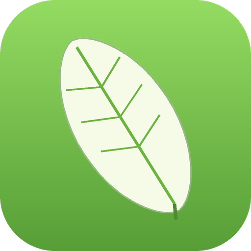

<div align="center">



# 🍃 NHLE — New Horizons Live Editor

**A cross-platform live memory editor for _Animal Crossing: New Horizons_ 3.0.3, driven over [sys-botbase](https://github.com/olliz0r/sys-botbase).**

Edit your inventory, freeze time and read or write the game's RAM **live, while the game is running** — no save-file injection.

[](https://github.com/SuliLabs/NHLE/actions/workflows/release.yml)


**🇬🇧 [English](#-english) · 🇪🇸 [Español](#-español)**

</div>

---

<a name="-english"></a>
## 🇬🇧 English

### What is NHLE?

NHLE is a desktop app ([Electron](https://www.electronjs.org/) + [React](https://react.dev/)) that connects to a Nintendo Switch over your local network and edits _Animal Crossing: New Horizons_ **3.0.3** in real time. It talks to the console with the sys-botbase `peek`/`poke` protocol, so **nothing is written to your save file** — every change happens in live RAM while you play.

The whole interface is available in **11 languages** and switches instantly, with a rounded, minimal Animal Crossing look.

> ⚠️ **Use at your own risk.** Memory editing can freeze the game or corrupt your island. Back up your save first. **Never use online.** This project is for offline, single-player experimentation only. It is not affiliated with Nintendo.

### Sections

| Section | What it does |
|---|---|
| 🏝️ **Home** | Live game version, island name, character name, console battery / language, and connection info. |
| 🎒 **Inventory** | Read and overwrite all **40 pocket slots**. Searchable item list (type in any case) with real item images, quantities, variations, wrapping and "buried" options. |
| ✨ **Cheats** | **Freeze time** today (more cheats coming). |
| 🧬 **Advanced** | A raw RAM read/write tool (peek/poke) for heap, main and absolute addresses. Gated behind a risk disclaimer you must accept. |

### Requirements

- A Nintendo Switch on **custom firmware** (Atmosphère) with **[sys-botbase](https://github.com/olliz0r/sys-botbase) 2.4+** installed.
- Switch and computer on the **same network**. You'll need the Switch's **IP address**.
- _Animal Crossing: New Horizons_ **3.0.3**, opened on your island.

> sys-botbase accepts **one connection at a time** — close other Switch tools before connecting.

### Download & run

Grab the latest build for your OS from the [**Releases**](https://github.com/SuliLabs/NHLE/releases) page:

| OS | File | How to run |
|---|---|---|
| Windows | `NHLE-x.y.z-win-x64.zip` | Unzip anywhere, run `NHLE.exe` |
| Linux | `NHLE-x.y.z-linux-x64.zip` | Unzip anywhere, run `./nhle` (`chmod +x nhle` if needed) |

Each `.zip` is self-contained — the executable plus everything it needs.

### First launch

1. Pick your **language**, type the Switch **IP** (the field shows `192.168.1.254` as an example) and **port** (`6000`), then **Connect**.
2. **First time only:** NHLE asks whether to show items with **real images**. If you say yes, the bundled sprite pack is unpacked once into a local folder, with a progress bar. Your choice is remembered.
3. You land on **Home**. Use the top tabs to move between sections.

### Build from source

```bash
git clone https://github.com/SuliLabs/NHLE.git
cd NHLE
npm install
npm run dev          # run with hot reload
npm run dist         # package a portable build for the current OS
```

> **Shared folders:** `npm install` does atomic renames that fail on some virtual/network filesystems (e.g. VirtualBox `vboxsf`). If you hit `ENOENT … rename`, copy the project to a normal local path first.

📖 A step-by-step guide for non-technical users lives in **[`docs/wiki/`](docs/wiki/Home.md)**.
🧠 The 3.0.3 memory map is documented in **[`docs/OFFSETS.md`](docs/OFFSETS.md)**.

---

<a name="-español"></a>
## 🇪🇸 Español

### ¿Qué es NHLE?

NHLE es una aplicación de escritorio ([Electron](https://www.electronjs.org/) + [React](https://react.dev/)) que se conecta a una Nintendo Switch por tu red local y edita _Animal Crossing: New Horizons_ **3.0.3** en tiempo real. Habla con la consola usando el protocolo `peek`/`poke` de sys-botbase, así que **no se escribe nada en tu partida guardada**: todos los cambios ocurren en la RAM mientras juegas.

Toda la interfaz está disponible en **11 idiomas** y cambia al instante, con un aspecto redondo y minimalista al estilo Animal Crossing.

> ⚠️ **Úsalo bajo tu propio riesgo.** Editar memoria puede congelar el juego o dañar tu isla. Haz una copia de seguridad de tu partida primero. **Nunca lo uses en línea.** Este proyecto es solo para experimentación offline, un jugador. No está afiliado a Nintendo.

### Secciones

| Sección | Qué hace |
|---|---|
| 🏝️ **Inicio** | Versión del juego, nombre de la isla, nombre del personaje, batería / idioma de la consola e información de conexión, en vivo. |
| 🎒 **Inventario** | Lee y reescribe los **40 espacios** del bolsillo. Lista de objetos con buscador (escribe en mayúsculas, minúsculas o mezclado) con imágenes reales, cantidades, variaciones, envoltorio y opción de "enterrado". |
| ✨ **Trucos** | **Congelar la hora** por ahora (se añadirán más trucos). |
| 🧬 **Avanzado** | Herramienta de lectura/escritura de RAM (peek/poke) para direcciones heap, main y absolutas. Protegida tras un aviso de riesgo que debes aceptar. |

### Requisitos

- Una Nintendo Switch con **firmware personalizado** (Atmosphère) y **[sys-botbase](https://github.com/olliz0r/sys-botbase) 2.4+** instalado.
- Switch y computadora en la **misma red**. Necesitas la **dirección IP** de la Switch.
- _Animal Crossing: New Horizons_ **3.0.3**, abierto en tu isla.

> sys-botbase acepta **una sola conexión a la vez**: cierra otras herramientas de Switch antes de conectar.

### Descargar y ejecutar

Descarga la última versión para tu sistema desde la página de [**Releases**](https://github.com/SuliLabs/NHLE/releases):

| Sistema | Archivo | Cómo ejecutar |
|---|---|---|
| Windows | `NHLE-x.y.z-win-x64.zip` | Descomprime donde quieras y abre `NHLE.exe` |
| Linux | `NHLE-x.y.z-linux-x64.zip` | Descomprime y ejecuta `./nhle` (`chmod +x nhle` si hace falta) |

Cada `.zip` es autónomo: el ejecutable más todo lo que necesita.

### Primer inicio

1. Elige tu **idioma**, escribe la **IP** de la Switch (el campo muestra `192.168.1.254` como ejemplo) y el **puerto** (`6000`), y pulsa **Conectar**.
2. **Solo la primera vez:** NHLE te pregunta si quieres ver los objetos con **imágenes reales**. Si dices que sí, el paquete de imágenes se descomprime una vez en una carpeta local, con una barra de progreso. Tu elección se recuerda.
3. Llegas a **Inicio**. Usa las pestañas de arriba para moverte entre secciones.

### Compilar desde el código

```bash
git clone https://github.com/SuliLabs/NHLE.git
cd NHLE
npm install
npm run dev          # ejecutar con recarga en caliente
npm run dist         # generar un ejecutable portable para tu sistema
```

> **Carpetas compartidas:** `npm install` hace renombrados atómicos que fallan en algunos sistemas de archivos virtuales/de red (p. ej. `vboxsf` de VirtualBox). Si ves `ENOENT … rename`, copia el proyecto a una ruta local normal primero.

📖 Hay una guía paso a paso para usuarios no técnicos en **[`docs/wiki/`](docs/wiki/Home.md)**.
🧠 El mapa de memoria de 3.0.3 está documentado en **[`docs/OFFSETS.md`](docs/OFFSETS.md)**.

---

## License / Licencia

[GPL-3.0](LICENSE)

<div align="center">
<sub>made by <b>SuliLabs</b> · Not affiliated with Nintendo. Animal Crossing is a trademark of Nintendo. For offline, single-player, educational use only.</sub>
</div>
